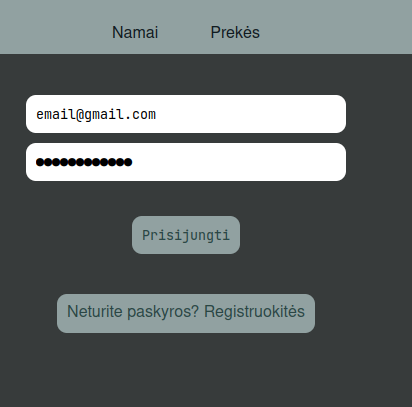
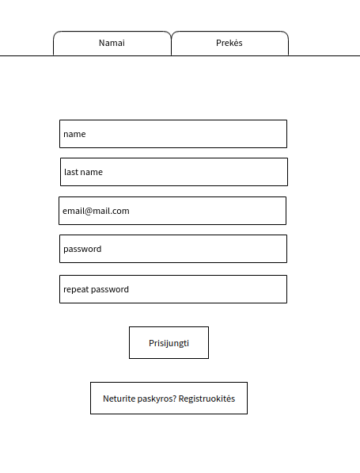

# FreeStore

## Sprendžiamo uždavinio aprašymas

### Sistemos paskirtis

Internetinė svetainė, kurioje sistemos naudotojai turi galimybę pirkti, parduoti, suteikti bet kokias prekes ar paslaugas.

Sistemą sudaro trys dalys:

- Klientinė dalis – ją sudaro grafinė naudotojo sąsaja ir logika leidžianti komunikuoti su serveriu;
- Serverio dalis – vykdo visą logiką susijusia su užklausų ir duomenų apdorojimu ir saugojimu duomenų bazėje;
- Duomenų bazė – saugo apdorotus duomenis, kurias galima pasiekti ir modifikuoti per SQL užklausų sąsają.

Lankytojas turi galimybę pradiniame puslapyje matyti parduodamas prekes ir trumpą jų informaciją. Bandydamas pamatyti išsamią informaciją apie prekę arba spustelėdamas prisijungimo mygtuką, bus nukreiptas į prisijungimo langą, kuriame jis galės prisijungti. Jei svetainės svečias neturi paskyros, jis turi galimybę prisiregistruoti.

Prisiregistravęs naudotojas gali modifikuoti savo profilį, prisijungimo duomenis ir kontaktinę informaciją ir gali ištrinti savo paskyrą. Naudotojas gali skelbti savo parduodamą prekę ar paslaugą ir priskirti tam tikrai jų kategorijai, nustatyti norimą kainą. Pardavėjas gali pažymėti prekę kaip rezervuotą arba parduotą, gali modifikuoti prekės informaciją ir ją šalinti. Paskelbus prekę, pardavėjas ar kiti naudotojai turi galimybę rašyti viešus komentarus po preke. Komentaro autorius gali redaguoti savo komentarą arba jį šalinti.

Sistemos administratorius turi prieigą prie visų prisiregistravusių naudotojų ir gali juos blokuoti. Jis taip pat gali pašalinti bet kurį komentarą ir prekę. Taip pat administratorius turi galimybę kurti ir keisti prekių ar paslaugų kategorijas.

### Funkciniai reikalavimai
Svetainės svečias gali:
- Prisijungti prie sistemos;
- Prisiregistruoti prie sistemos;
- Peržiūrėti parduodamas prekes;

Prisiregistravęs naudotojas gali:
- Atsijungti nuo sistemos;
- Peržiūrėti parduodamas prekes;
- Redaguoti savo profilį;
- Šalinti savo paskyrą;
- Paskelbti norimą parduoti prekę, redaguoti jos informaciją ir būseną, ją šalinti;
- Pridėti komentarą po paskelbta preke, redaguoti savo komentarą, jį šalinti.

Sistemos administratorius gali:
- Viską, ką gali daryti prisiregistravęs naudotojas;
- Blokuoti kitus naudotojus;
- Šalinti kitų naudotojų parduodamas prekes;
- Šalinti kitų naudotojų komentarus
- Kurti prekių ar paslaugų kategorijas, jas modifikuoti ir šalinti.

## Sistemos architektūra

Paveiksle žemiau yra pateikta sistemos diegimo diagrama, kurioje klientas gali per naršyklę komunikuoti su serveriu. Klientinei daliai kurti bus naudojamas Vue.js Javascript karkasas, ji komunikuos su API, kuriam bus naudojamas Asp.net karkasas. Duomenų bazė bus kuriama naudojant MySQL.

<!-- 
 -->

## Naudotojo sąsajos projektas

Šioje dalyje bus apžvelgiamos naudotojo sąsajos langų wireframe'ai ir realizuoti pavyzdiniai langai, kurie yra pasiekiami per internetinį puslapį. Wireframe'ai buvo sukurti naudojant nemokamą įrankį MockFlow.

Visa sąsaja susidaro iš 3 dalių

- Antraštė (Header) - joje yra svetainės pavadinimas, meniu juosta ir prisijungimo/atsijungimo mygtukas,
- Turinys (Content) - joje yra išdėstomas turinys atitinkamai, kurioje svetainės dalyje esama,
- Poraštė (Footer) - papildoma žymė su svetainės pavadinimu ir darbo autoriu

### Naudotojo langai

Čia yra išdėstyti visi langai kartu su jų wireframe'ais.

Namų sąsaja:

Prisijungimo sąsaja:

Registracijos sąsaja:

Prisijungusio naudotojo antraštė:

Naujo skelbimo kūrimo sąsaja:

Naujos kategorijos kūrimo sąsaja:

Asmeninio profilio sąsaja

Prekių įrašų sąsaja

Prekių detalių sąsaja

## Sistemos API dokumentacija

Sistemos serverinės dalies API dokumentacija yra pateikta **[šioje nuorodoje](freestore-server/server/README.md)**.

## Išvados

Norint sukurti internetinį puslapį, neužtenka vien nusimanyti apie dalykinę sritį, tačiau ir apie visos sistemos planavimą, projektavimą ir kūrimą. Kuriant svarbu atsižvelgti, kaip skirtingos sistemos dalys komunikuos, kaip ir kur jos bus talpinamos ir kiek žmonių naudosis ja, kokiais įrenginiais vartotojai naudosis puslapiu. Jei į šias problemas nėra gerai atsižvelgiama, gali kilti problemų programuotojams ir sukelti nepatogumų naudotojams.
